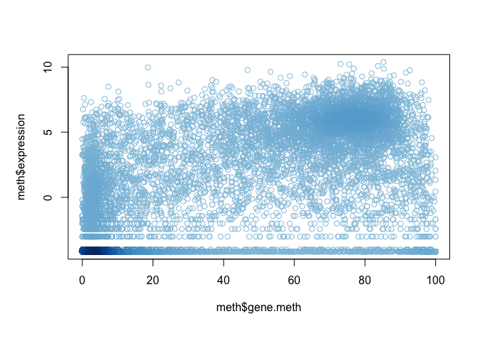

Class 05 - R graphs
================
Xuqian Tan
Jan 22, 2019

``` r
# Class 05 R graph intro
```

This is some test and I can have **bold** and *Italic* and `code`

``` r
# My first project
x <- rnorm(1000,0)
boxplot( x )
```


``` r
summary(x)
```

    ##     Min.  1st Qu.   Median     Mean  3rd Qu.     Max. 
    ## -3.02925 -0.59965  0.04374  0.01085  0.63005  2.80248

``` r
hist(x)
```


I have generate x and it has 1000

``` r
boxplot(x, horizontal = TRUE)
```


``` r
plot( 1:5, pch=1:5, cex=1:5 )
```


``` r
barplot(VADeaths, beside = TRUE)
```


``` r
barplot(VADeaths, beside = FALSE)
```


``` r
# Hands on session 2

# 2A
weight_age <- read.table("bimm143_05_rstats/weight_chart.txt", header = TRUE)
plot(weight_age, typ = "b", pch=15, cex=1.5, lwd=2, ylim=c(2,10), xlab="Age (months)", ylab="Weight (kg)", main="Baby weight with age")
```


``` r
# 2B
GRCm38 <- read.table("bimm143_05_rstats/feature_counts.txt", header = TRUE, sep = "\t")
par(mar=c(3.1, 11.1, 4.1, 2))
barplot(GRCm38$Count, horiz = TRUE, names.arg = GRCm38$Feature, las = 1, main = "Number of features in the mouse GRCm38 genome", xlim=c(0,80000))
```


``` r
# 2C
par(mar=c(3.1, 5, 4, 2))
hist(c(rnorm(10000),rnorm(10000)+4), breaks = 20)
```


``` r
# 3A
par(mar=c(6, 5, 4, 2))
male_female <- read.table("bimm143_05_rstats/male_female_counts.txt", header = TRUE, sep = "\t")
barplot(male_female$Count, horiz = FALSE, col=rainbow(nrow(male_female)), names.arg = male_female$Sample, ylab = "Counts", las = 2)
```


``` r
# 3B
genes <- read.table("bimm143_05_rstats/up_down_expression.txt", header = TRUE)
nrow(genes)
```

    ## [1] 5196

``` r
table(genes$State)
```

    ## 
    ##       down unchanging         up 
    ##         72       4997        127

``` r
palette(c("blue", "gray", "red"))
plot(genes$Condition1, genes$Condition2, col=genes$State, xlab = "genes condition 1", ylab = "genes condition 2")
```


``` r
#3C
meth <- read.table("bimm143_05_rstats/expression_methylation.txt", header = TRUE)
nrow(meth)
```

    ## [1] 9241

``` r
dcol <- densCols(meth$gene.meth,meth$expression)
plot(meth$gene.meth, meth$expression, col = dcol)
```



``` r
inds <- meth$expression > 0
dcol <- densCols(meth$gene.meth[inds],meth$expression[inds], colramp = colorRampPalette(c("blue", "green", "red", "yellow")))
plot(meth$gene.meth[inds], meth$expression[inds], col = dcol, pch = 20)
```


