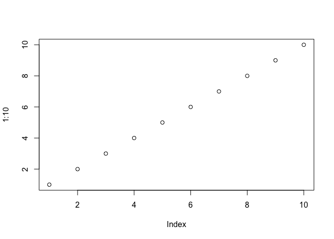
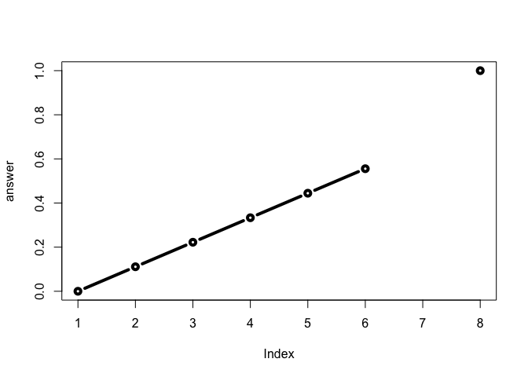

Class06
================
Xuqian Tan
1/24/2019

### Section 1: Reading files again :-)

Here we are going to try using the **read.table()** function and friends to read some example flat files

First lets try adding a simple plot

``` r
plot(1:10)
```



Back to file reading...

``` r
read.table("https://bioboot.github.io/bimm143_W19/class-material/test1.txt", header = TRUE, sep = ",")
```

    ##   Col1 Col2 Col3
    ## 1    1    2    3
    ## 2    4    5    6
    ## 3    7    8    9
    ## 4    a    b    c

For this common CSV, we could use **read.csv()**

``` r
file1 <- "https://bioboot.github.io/bimm143_W19/class-material/test1.txt"
read.csv(file1)
```

    ##   Col1 Col2 Col3
    ## 1    1    2    3
    ## 2    4    5    6
    ## 3    7    8    9
    ## 4    a    b    c

Read other files

``` r
table2 <- read.table("https://bioboot.github.io/bimm143_W19/class-material/test2.txt", header = TRUE, sep = "$")
table3 <- read.table("https://bioboot.github.io/bimm143_W19/class-material/test3.txt", header = FALSE)
table2
```

    ##   Col1 Col2 Col3
    ## 1    1    2    3
    ## 2    4    5    6
    ## 3    7    8    9
    ## 4    a    b    c

``` r
table3
```

    ##   V1 V2 V3
    ## 1  1  6  a
    ## 2  2  7  b
    ## 3  3  8  c
    ## 4  4  9  d
    ## 5  5 10  e

Section 2, R functions
----------------------

My first silly function

``` r
add <- function(x, y=1) {
  # Sum the input x and y
  x + y
}
```

Let's try using the function

``` r
add(1)
```

    ## [1] 2

``` r
add(1,100)
```

    ## [1] 101

``` r
add(c(1,2,3),4)
```

    ## [1] 5 6 7

``` r
rescale <- function(x) {
  rng <-range(x)
  (x - rng[1]) / (rng[2] - rng[1])
}
```

test on a small example where we know what the answer should be

``` r
rescale(1:10)
```

    ##  [1] 0.0000000 0.1111111 0.2222222 0.3333333 0.4444444 0.5555556 0.6666667
    ##  [8] 0.7777778 0.8888889 1.0000000

``` r
rescale(c(1,2,NA,3,10))
```

    ## [1] NA NA NA NA NA

``` r
rescale2 <- function(x) {
  rng <-range(x, na.rm = TRUE)
  (x - rng[1]) / (rng[2] - rng[1])
}

rescale2(c(1,2,NA,3,10))
```

    ## [1] 0.0000000 0.1111111        NA 0.2222222 1.0000000

``` r
rescale3 <- function(x, na.rm=TRUE, plot=FALSE) {
  rng <-range(x, na.rm=na.rm)
  print("Hello")
  answer <- (x - rng[1]) / (rng[2] - rng[1])
  print("is it me you are looking for?")
  if(plot) {
    plot(answer, typ="b", lwd=4)
  }
  print("I can see it in ...")
  return(answer)
}
```

``` r
rescale3(c(1:6, NA, 10), plot = TRUE)
```

    ## [1] "Hello"
    ## [1] "is it me you are looking for?"



    ## [1] "I can see it in ..."

    ## [1] 0.0000000 0.1111111 0.2222222 0.3333333 0.4444444 0.5555556        NA
    ## [8] 1.0000000

Hands on section 1B
-------------------

``` r
# Can you improve this analysis code?
library(bio3d)
s1 <- read.pdb("4AKE") # kinase with drug
```

    ##   Note: Accessing on-line PDB file

``` r
s2 <- read.pdb("1AKE") # kinase no drug
```

    ##   Note: Accessing on-line PDB file
    ##    PDB has ALT records, taking A only, rm.alt=TRUE

``` r
s3 <- read.pdb("1E4Y") # kinase with drug
```

    ##   Note: Accessing on-line PDB file

``` r
s1.chainA <- trim.pdb(s1, chain="A", elety="CA")
s2.chainA <- trim.pdb(s2, chain="A", elety="CA")
s3.chainA <- trim.pdb(s1, chain="A", elety="CA")

s1.b <- s1.chainA$atom$b
s2.b <- s2.chainA$atom$b
s3.b <- s3.chainA$atom$b

plotb3(s1.b, sse=s1.chainA, typ="l", ylab="Bfactor")
```


``` r
plotb3(s2.b, sse=s2.chainA, typ="l", ylab="Bfactor")
```


``` r
plotb3(s3.b, sse=s3.chainA, typ="l", ylab="Bfactor")
```


``` r
Analysis <- function(name) {
  s <- read.pdb(name)
  s.chainA <- trim.pdb(s1, chain="A", elety="CA")
  s.b <- s1.chainA$atom$b
  plotb3(s.b, sse=s.chainA, typ="l", ylab="Bfactor")
}
```

test

``` r
names <- c("4AKE", "1AKE", "1E4Y")
for (i in names){
  Analysis(i)
}
```

    ##   Note: Accessing on-line PDB file

    ## Warning in get.pdb(file, path = tempdir(), verbose = FALSE): /var/folders/
    ## m7/klc0vqy504s_v0498wvlm09r0000gn/T//Rtmp4zF0oc/4AKE.pdb exists. Skipping
    ## download

    ##   Note: Accessing on-line PDB file

    ## Warning in get.pdb(file, path = tempdir(), verbose = FALSE): /var/folders/
    ## m7/klc0vqy504s_v0498wvlm09r0000gn/T//Rtmp4zF0oc/1AKE.pdb exists. Skipping
    ## download

    ##    PDB has ALT records, taking A only, rm.alt=TRUE

    ##   Note: Accessing on-line PDB file

    ## Warning in get.pdb(file, path = tempdir(), verbose = FALSE): /var/folders/
    ## m7/klc0vqy504s_v0498wvlm09r0000gn/T//Rtmp4zF0oc/1E4Y.pdb exists. Skipping
    ## download


